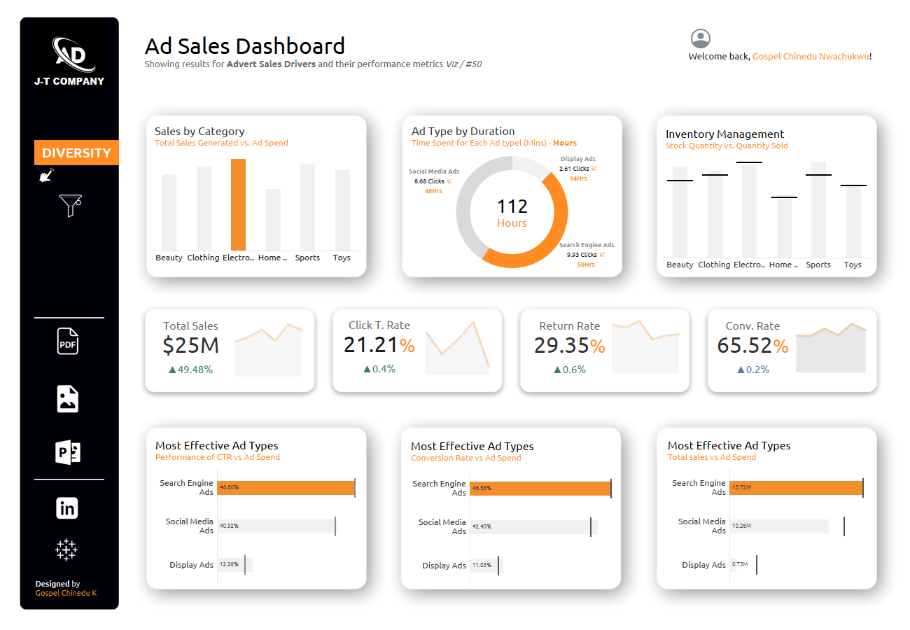

<!--Section 1: Introduce your self-->
## PROFILE SUMMARY

👋 Hello!
I'm **Gospel Chinedu K.**, a passionate Data Analyst based in Rivers State, Nigeria. I specialize in transforming raw data into actionable insights that drive business decisions. With a strong background in tools like Excel, Power BI, SQL, and Tableau, I strive to enhance data visualization and storytelling.

## Experience
I am experienced, dedicated, results-oriented in Deskside Support and Help Desk Services with the Concept and scope of work which includes sever management, content development, Incident Management, software and hardware including Microsoft applications. 

<!--Mention your top/relevant skills here - core and soft skills-->
## WHAT I DO

* As Diligent ICT support specialist and Proffesional Data Analyst with 5+ years experience with IT services agencies, with a demonstrated history of working in the information technology and services industry thereby attaining professional and successful results in MDA (SQL TABLEAU) IT Support Personal, Using ICT and digital life style resource .

**- ✅ Data Analytics Consulting.**
I provide in-depth analysis and tailored solutions to help you make data-driven decisions, optimize processes, and drive business growth. 

**- ✅ Staff Training & Development.**
I offer comprehensive training programs in data analysis, visualization, and data-driven decision-making. From beginner to advanced levels. 

**- ✅ Tableau Developer | Data Story Telling | Data Analyst |** 
Developing Tableau Storytelling for an Informed, Data-Driven World: Transforming Uncertainty into Insight.
- Follow me and I follow back!. 

<!--Section 2: List 3-4 key projects-->
## MY PORTFOLIO 
[Click to View My Portfolio](https://public.tableau.com/app/profile/gospel.chinedu.nwachukwu/vizzes)

*Feel free to explore my Real world projects and work.*

**Analysis Modelling and Design Implimentaion using JT Advertizing Sales Company.**

Ad Sales Dashboard 
Showing results for Advert Sales Drivers and their performance metrics Viz / #50.
[Dashboard](https://public.tableau.com/app/profile/gospel.chinedu.nwachukwu/viz/Ads-SalesDashboard/Dashboard1)

[Read More](https://www.linkedin.com/feed/update/urn:li:activity:7303581624032481280/)

**Predictive Modeling and Hypothesis Testing using Titanic Dataset.**

On April 15, 1912, during her maiden voyage, the widely considered “unsinkable” RMS Titanic sank after colliding with an iceberg. 

[Read More](https://www.linkedin.com/pulse/predictive-modeling-hypothesis-testing-using-titanic-dataset-anietie/)

**Predictive Modeling and Hypothesis Testing using Titanic Dataset.**

Unfortunately, there weren’t enough lifeboats for everyone onboard, resulting in the death of 1502 out of 2224 passengers and crew. 

[Read More](https://www.linkedin.com/pulse/predictive-modeling-hypothesis-testing-using-titanic-dataset-anietie/)

## MY CLASSES

*Call my admin for details about the classes: 08034730987.*

- Settings | One-on-One, Group, Communities.								       		
- Platforms	| Physical or Virtual, Weekday or Weekend. 			        		
- Courses | Advanced Excel, Statistics, Power BI, SQL, Tableau, Python.

<!--Section 3: This section is optional. You can replace this section with a list of your core skills-->
## MY COURSES
*You can get these courses today.*

**Performance Analysis**

Advanced Data Analytics: Mastering the Craft with Portfolio Project using Excel. Master data analytics by solving real-world sales problems using MS Excel 2021, learn core dashboard design and presentation skills and create your portfolio project. This course is designed for beginners and professional data analyst.

[Get this course](https://selar.co/salesdata)

**Attrition Analysis**

In this course, you will learn how to analyze HR and employee data, including demographics, job roles, performance metrics, and workplace satisfaction, to identify the underlying causes and predictors of employee attrition.

[Get this course](https://selar.co/q688i7)

## CONTACT DETAILS

*Let’s connect and see how we can make a difference together!*
<table>
  <tbody>
    <tr>
      <td>📧</td>
      <td><a href="mailto:anietieetuk@gmail.com">anietieetuk@gmail.com</a></td>
    </tr>
    <tr>
      <td>📞</td>
      <td>(234) 816-763-7212</td>
    </tr>
    <tr>
      <td>📍</td>
      <td>PH, Nigeria</td>
    </tr>
    <tr>
      <td>⬇️</td>
      <td><a href="https://etuk123456.github.io/portfolio1/docs/Profile.pdf">Download my CV</a></td>
    </tr>
    <tr>
      <td>🌐</td>
      <td><a href="https://linkedin.com/in/etukanietie">The things I do daily on LinkedIn</a></td>
    </tr>
    <tr>
      <td>📺</td>
      <td><a href="https://www.youtube.com/@LearnwithEtuk">Watch my tutorials on YouTube</a></td>
    </tr>
  </tbody>
</table>

   

