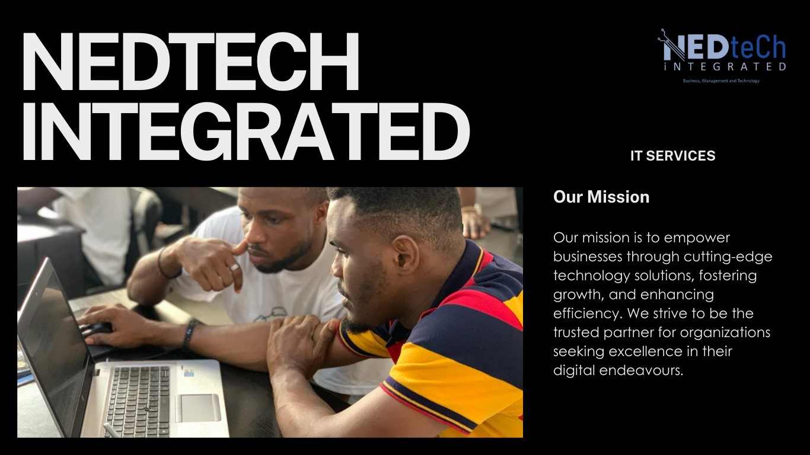

<!--Section 1: Introduce your self-->
## PROFILE SUMMARY

👋 Hello!
I'm **Gospel Chinedu K.**, a passionate Data Analyst based in Rivers State, Nigeria. I specialize in transforming raw data into actionable insights that drive business decisions. With a strong background in tools like Excel, Power BI, SQL, and Tableau, I strive to enhance data visualization and storytelling.

## Experience
I am experienced, dedicated, results-oriented in Deskside Support and Help Desk Services with the Concept and scope of work which includes sever management, content development, Incident Management, software and hardware including Microsoft applications. 

<!--Mention your top/relevant skills here - core and soft skills-->
## WHAT I DO

* As Diligent ICT support specialist and Proffesional Data Analyst with 5+ years experience with IT services agencies, with a demonstrated history of working in the information technology and services industry thereby attaining professional and successful results in MDA (SQL TABLEAU) IT Support Personal, Using ICT and digital life style resource .

**- ✅ Data Analytics Consulting.**
I provide in-depth analysis and tailored solutions to help you make data-driven decisions, optimize processes, and drive business growth. 

**- ✅ Staff Training & Development.**
I offer comprehensive training programs in data analysis, visualization, and data-driven decision-making. From beginner to advanced levels. 

**- ✅ Tableau Developer | Data Story Telling | Data Analyst |** 
Developing Tableau Storytelling for an Informed, Data-Driven World: Transforming Uncertainty into Insight.
- Follow me and I follow back!. 

<!--Section 2: List 3-4 key projects-->
## MY PORTFOLIO 
[Click to View My Portfolio](https://public.tableau.com/app/profile/gospel.chinedu.nwachukwu/vizzes)

*Feel free to explore my Real world projects and work.*

**Analysis Modelling and Design Implimentaion using JT Ad Sales.**

Ad Sales Dashboard 
Showing results for Advert Sales Drivers and their performance metrics Viz / #50...
[Tableau Viz](https://public.tableau.com/app/profile/gospel.chinedu.nwachukwu/viz/Ads-SalesDashboard/Dashboard1)

[Read More](https://www.linkedin.com/feed/update/urn:li:activity:7303581624032481280/)

**Analysis Modeling and Story Telling using HealthPlus(+) RWFD.**

Healthcare service providers face challenges in managing patient bookings, reducing missed appointments, and improving patient satisfaction

✅ This Dashboard is designed with digital transformation parameter tool,  playing a crucial role in optimizing patient care and service delivery... 
[Tableau Viz](https://public.tableau.com/app/profile/gospel.chinedu.nwachukwu/viz/HealthPlusDashboard/HEALTHPlusDASHBOARD)

[Read More](https://www.linkedin.com/feed/update/urn:li:activity:7313765139105677313/)

**Predictive Modeling, Story telling and Time Series using Super Store Sales.**

While separating dashboards is common for clarity 💯, 🤔 Combining sales and customer dashboards in one page can be a smart move when done right

One page keeps things simple for Non-technical users. No need to toggle between tabs , just one clean interactive view.. [Tableau Viz](https://public.tableau.com/app/profile/gospel.chinedu.nwachukwu/viz/SalesCustomerDashboardIMPV/SalesDashboard2)

[Read More](https://www.linkedin.com/feed/update/urn:li:activity:7319984104995774464/)

**Analysis Design Story telling and Modelling using Hotel Guest Feedback.**

Understanding the demographics and booking patterns of the hotel's guests, Hence Evaluating guest satisfaction and loyalty, including factors that influence their satisfaction and NPS ratings.
[Tableau Viz](https://public.tableau.com/app/profile/gospel.chinedu.nwachukwu/viz/HotelCustomerServiceFeedback/MainDashboard)

**Analysis Design Story telling and Modelling using Global Choco Sales.**

The Performance of the Dashboard Uncovered meaninful insight, Showing...
👉Progress Bar Chart showing Sales Agents & $Sales %
👉Relationship between $ Sales & # Quantity
👉Clickable Filter Drop down Button
👉Calendar Filter button Slicing through Month/Week/Day [Tableau Viz](https://public.tableau.com/app/profile/gospel.chinedu.nwachukwu/viz/CHOCOSALESANALYTICDASHBOARD/CHOCOSALESDB1)

**Analysis Design Story telling and Modelling using Breast Cancer Survivals.**

The CMD will love to know which Stage of cancer is more Threatening so as to channel preventive awareness, surgery type with the highest occurrence, Patient status distribution volume also to track the age band Insurance Frequency Distribution and the Year with the Highest Surgery Occurrence including Valued KPIs.
[Tableau Viz](https://public.tableau.com/app/profile/gospel.chinedu.nwachukwu/viz/CHOCOSALESANALYTICDASHBOARD/CHOCOSALESDB1)

## MY SERVICES

*Contact for Support Services: 08068799778.*

- **Consultant**| Private, Business, Companies, Educational Centers.							       		
- **Platforms**| Physical, Virtual, Remotely, In-person 			        		
- **Courses**| ICT Digital Life Style, Excel Power BI, SQL Tableau, AWS.

<!--Section 3: This section is optional. You can replace this section with a list of your core skills-->
## LEARNING RESOURCES
*Click to Access Videos and Learning Materials.*

[YOUTUBE](https://www.youtube.com/@NedteCh)

**Data Visualization**
.png)
Developing Tableau Storytelling for an Informed, Data-Driven World: Transforming Uncertainty into Insight.
- Follow me and I follow back!

[Visit Our Website](https://nedtech.my.canva.site/)

**Support Services**

**What Sets Us Apart** 
- Expertise in ICT and Digital Lifestyle, and the way technology influences the daily activities of individuals, including how they communicate, work, entertain themselves, and manage their lives.  
- Data Analytics Unlock the power of your data with our advanced Data Analytics services. We turn raw data 
into actionable insights, helping you make informed decisions and gain a competitive edge in 
your industry.

[Follow Me Here](https://www.youtube.com/@NedteCh)

## CONTACT DETAILS

*Let’s connect and see how we can make a difference together!*
<table>
  <tbody>
    <tr>
      <td>📧</td>
      <td><a href="mailto:gospe4life@gmail.com">gospe4life@gmail.com</a></td>
    </tr>
    <tr>
      <td>📞</td>
      <td>(234) 806-879-9778</td>
    </tr>
    <tr>
      <td>📍</td>
      <td>Lagos, Nigeria</td>
    </tr>
    <tr>
      <td>⬇️</td>
      <td><a href="[https://etuk123456.github.io/portfolio1/docs/Profile.pdf](https://public.tableau.com/app/profile/gospel.chinedu.nwachukwu/viz/ProfessionalResume-GospelChineduk/Gospel_Resume_DashBoard)">Download my CV</a></td>
    </tr>
    <tr>
      <td>🌐</td>
      <td><a href="https://www.linkedin.com/in/neduchinex/">The things I do daily on LinkedIn</a></td>
    </tr>
    <tr>
      <td>📺</td>
      <td><a href="https://www.youtube.com/@NedteCh">Watch my tutorials on YouTube</a></td>
    </tr>
  </tbody>
</table>

   

